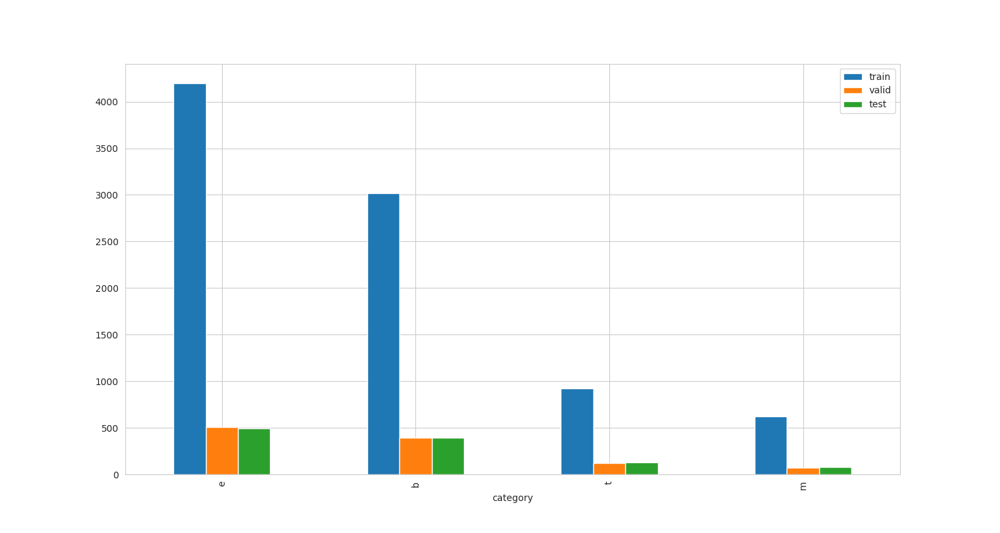
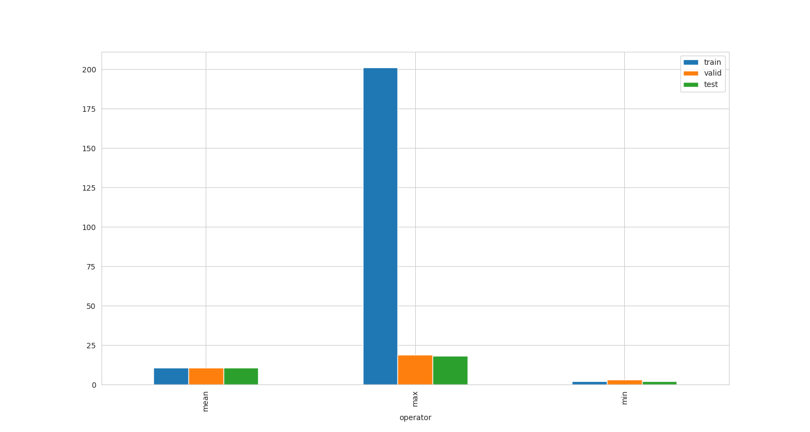

## Test 2 

The project aims to classify the documents based on their title

```bash
./Test2/
│
├── dataset/
│   ├── eda             # Results of Exploratory data analysis 
│   ├── train.text      # Training dataset
│   ├── test.text       # Testing dataset
│   └── valid.text      # Testing dataset
│
│
├── src/
│   ├── config          # Configuration
│   ├── data            # Exploratory data analysis 
│   ├── deploy          # Rest API
│   ├── models          # machine learning model list
│   └── tools           # training, evaluation and hyper optimizer
│
├── README.md           # Detail information about project
└── requirements.txt    # packeges need to install

```

## 1. Installation

Please install the environment following command:
```
pip install -r requirements.txt
```

## 2. Dataset Preparation (problem 2-1)
Please download [News Aggregator Dataset]() to put them in the `dataset` folder

To extract and divide the dataset into train, valid, and test. Please follow the command line

```shell
$python -m src.data.new_aggregator
```

`train.txt`, `valid.txt`, and `test.txt` are saved to the `dataset/news_aggregator` folder.

## 3. Data Exploration (problem 2-2)

To statistic dataset on train, valid, test. Please follow the command line:

```shell
$python -m src.data.eda
```

Results:

| <p align="center">Category EDA</p> | <p align="center">Word EDA</p>|
|--|--|
|  |  |


## 4. Model selection (problem 2-3)

**Machine Learning Models**

List of ML Classifier Models
+ XGBClassifier
+ RandomForestClassifier
+ GradBoostClassifier
+ AdaBoostClassifier
+ MultinomialNB


## 5. Training and Evaluation (problem 2-3, 2-4)

**Hyper Parameter Optimization**

To search for the best parameters of each model on the valid dataset. Please follow the command line:
```shell
python -m src.tools.hyper_params
```

The hyper-parameters will be saved in the `.cache/hyper_params` folder

**Training with the best parameters**

To train models:
```shell
$python -m src.tools.train_ml
```
The best model will be evaluated and saved in the `.cache/best_model` folder

**Model Comparisons**

| Mode | f1_socre |
|--|--|
| RandomForestClassifier | 0.786438 |
| GradBoostClassifier | 0.829491 |
| AdaBoostClassifier | 0.790439 |
| XGBClassifier | 0.893846 |
| **MultinomialNB** | **0.912011** |

## 7. Model Deployment (problem 2-5)

**List of labels endpoint**
```shell
$python -m src.deploy.list_label_api
```

GET request:
```bash
curl -v http://127.0.0.1:2005/list_label
```
GET response:
```bash
{
  "labels": [
    "b",
    "e",
    "m",
    "t"
  ]
}
```

**Classify endpoint**
```shell
$python -m src.deploy.predict_api
```

POST request: 
```bash
curl -d '{"text":"US FDA approves MannKinds diabetes therapy Afrezza"}' -H 'Content-Type: application/json' http://127.0.0.1:2005/classify 
```
POST response:
```bash
{
  "predicted_label": "m",
  "prob": 0.999983884151763,
  "text": "US FDA approves MannKinds diabetes therapy Afrezza"
}

```

## 8. Reference

>+ [News Aggregator](https://archive.ics.uci.edu/dataset/359/news+aggregator)


